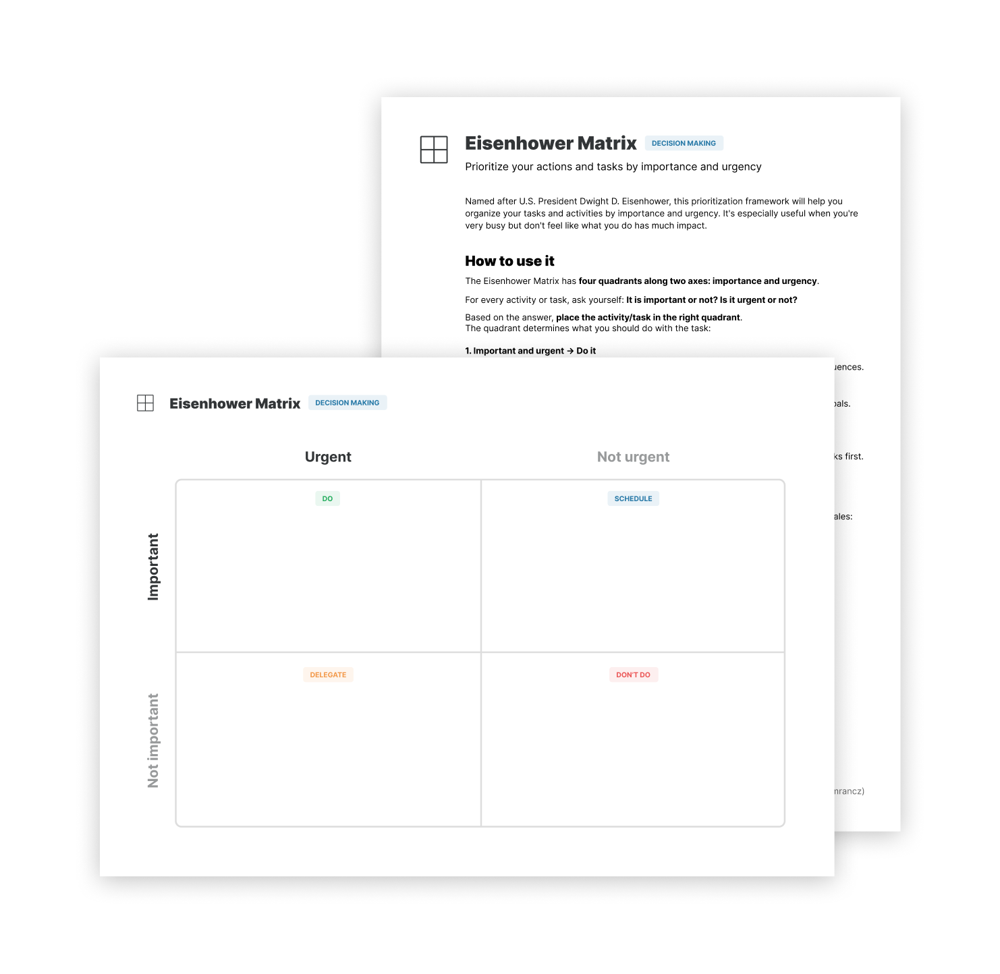

# Eisenhower Matrix

**Prioritize your actions and tasks by importance and urgency**

Named after U.S. President Dwight D. Eisenhower, this prioritization framework will help you organize your tasks and activities by importance and urgency. It's especially useful when you're very busy but don't feel like what you do has much impact.

How to use it
-------------

The Eisenhower Matrix has **four quadrants along two axes: importance and urgency**.  
For every activity or task, ask yourself: It is important or not? Is it urgent or not?

Based on the answer, **place the activity/task in the right quadrant. The quadrant determines what you should do with the task**:

#### 1\. Important and urgent → Do it

* These are the tasks that you want to do as soon as possible. 
* Crises, pressing problems and other things where not acting now has negative consequences.

#### 2\. Important but not urgent → Schedule it

* Find a time for these tasks and do them then.
* This quadrant is typically where deep work happens – tasks that contribute to your projects or long-term goals.

#### 3\. Urgent but not important → Delegate it

* If you can, find someone who can do these tasks for you.
* If you can't delegate it, schedule it but always try to do the important-but-not-urgent tasks first.
* These are often administrative tasks or things that have deadlines but aren't critical.

#### 4\. Not urgent and not important → Don't do it

* These tasks aren't worth your time and you shouldn't do them at all.
* Avoidance activities, busy work and entertainment goes into this quadrant.

This is also the order of the priority of your tasks. Yes, important-but-not-urgent tasks come before urgent-but-not-important.

Eisenhower matrix is very flexible so it's up to you if you use it for professional tasks, personal ones or both.

You can also work with it on different timescales: planning your day vs. generally prioritizing activities in your life.

### How do you tell urgent tasks from important ones?

Urgent tasks typically have a clear deadline (e.g. sending a draft to a client) or require you to react in a timely fashion (e.g. emails). Important tasks tend to be aligned with your long-term goals (e.g. exercising) and push your projects forward (e.g. writing code for your side project).

Determining urgency and importance will always depend on your context and your ability to recognize what's truly urgent and truly important.

Example
-------

Here are some examples of activities and tasks that might go into the Eisenhower Matrix:

|     |     |     |
| --- | --- | --- |
|     | **Urgent** | **Not urgent** |
| **Important** | _Do:_  Finish a report that's due   Send draft to client   Fix a bug | _Schedule:_  Design a new feature   Write a blog post   Exercise |
| **Not important** | _Delegate/schedule for later_:  Buy a conference ticket   Schedule an interview   Reply to emails | _Don't do:_  Attend a meeting with no agenda   Read #random   Check social media |

Takeaway
--------

The promise of the Eisenhower Matrix is to **make you more productive by setting the right priorities and acting on them**. If you're always busy but don't get anywhere on your long-term projects and goals, this tool is definitely for you. But it's also a generally useful tool for deciding what to work on and what to eliminate from your life.

Put it to practice
------------------

I created a handy worksheet to help you put this tool into practice. It comes with a simple how-to guide including an example.

Print out the PDF or fill it in digitally and use it to better understand systems:

[Get the worksheet](https://gumroad.com/l/untools-worksheets)

Preview of the worksheet and guide:

### Sources

["How to be More Productive and Eliminate Time Wasting Activities by Using the “Eisenhower Box” " by James Clear](https://jamesclear.com/eisenhower-box)

["The Eisenhower Matrix" on Todoist](https://todoist.com/productivity-methods/eisenhower-matrix)